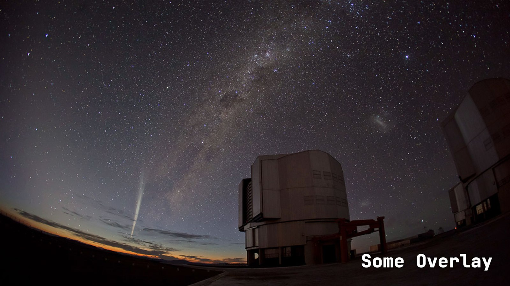
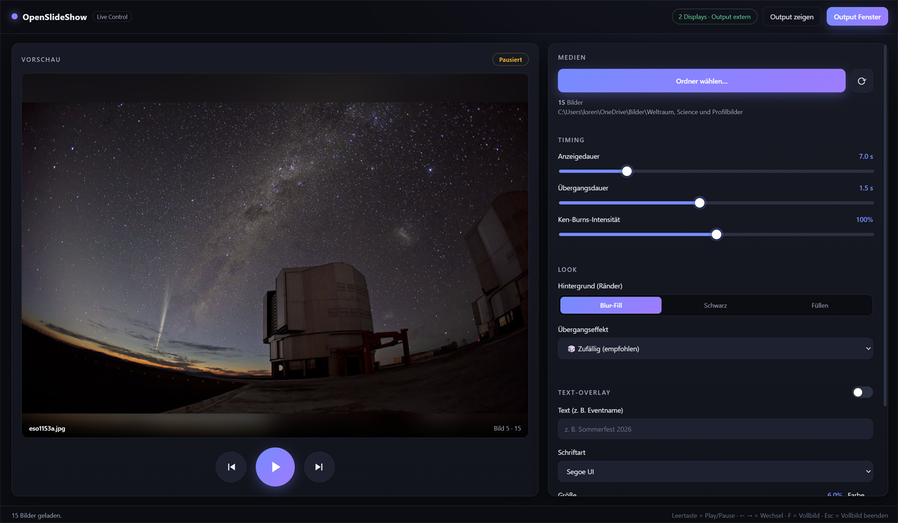
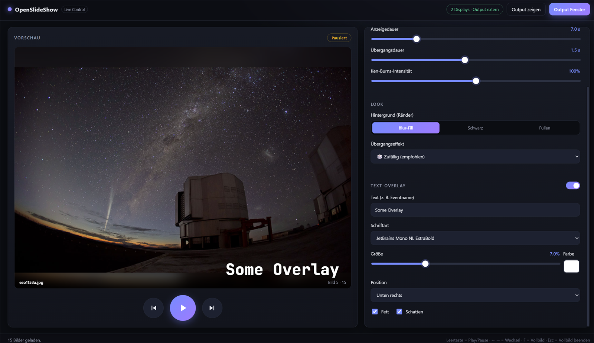
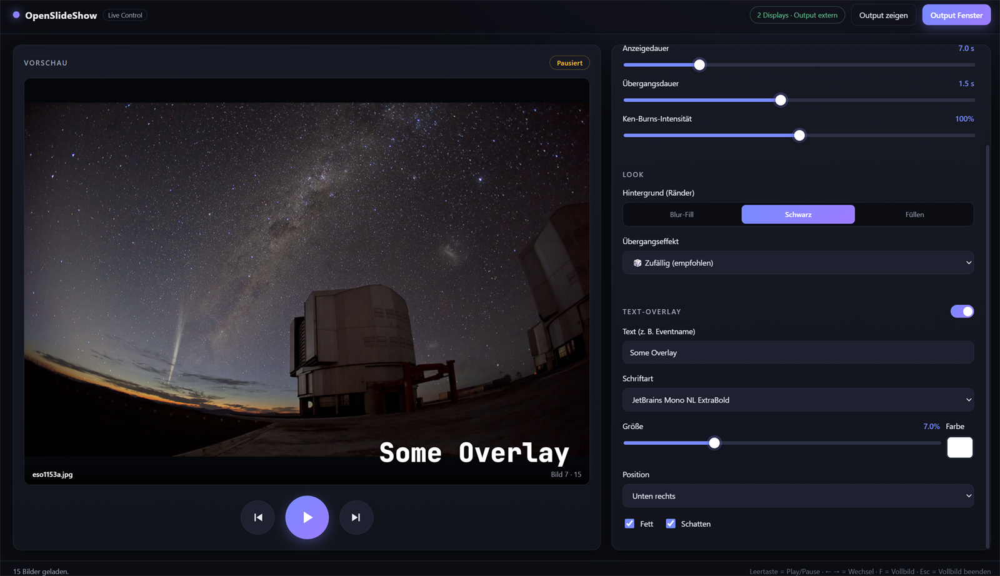
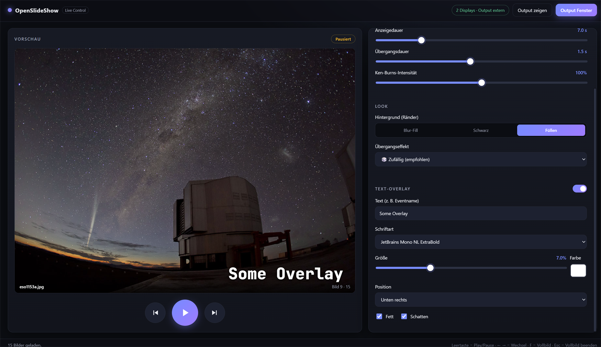

<div align="center">


# OpenSlideShow

**Dynamische, live-steuerbare Präsentations-Software für Events.**
Dual-Monitor · Ken Burns · randomisierte Transitions · Text-Overlay — in Echtzeit bedienbar.


</div>

<div align="center">
  
  <br />
  <em>Beamer-Ausgabe: rahmenloses Vollbild, kein UI, kein Mauszeiger — nur das Bild fürs Publikum.</em>
</div>

---

OpenSlideShow ist **keine** Video-Export-Lösung, sondern eine **Echtzeit-Anwendung**: Du bedienst,
konfigurierst und pausierst die Show **während** des Events. Gebaut mit **Electron** — native
Dual-Monitor-Unterstützung, GPU-beschleunigtes Rendering (Chromium-Compositor) für butterweiche
Animationen und direkter Dateisystem-Zugriff. Läuft auf Windows.

## ✨ Features

- 🖥️ **Dual-Monitor-Architektur** — strikt getrennt:
  - **Control-Panel** (Monitor 1): modernes Dashboard mit Live-Vorschau, Transport-Steuerung und Konfiguration.
  - **Output-Screen** (Monitor 2 / Beamer): rahmenloses Vollbild, **kein** UI, **kein** Mauszeiger.
  - Bei nur einem Monitor läuft der Output als Fenster (Dev/Test) — per Knopf in den Beamer-Vollbildmodus schaltbar.
- 🎞️ **Robustes Medien-Handling** — liest einen lokalen Ordner (rekursiv) mit Bildern beliebiger
  Größe/Auflösung/Seitenverhältnis. Reihenfolge **randomisiert** (Fisher–Yates, keine direkten Wiederholungen).
- 🌫️ **Keine hässlichen schwarzen Ränder** — sharp `contain`-Bild vor einem unscharfen `cover`-Hintergrund
  („Blur-Fill"). Alternativ Schwarz oder Füllen.
- 🔍 **Permanenter Ken-Burns-Effekt** — kontinuierliches, sanftes Zoomen & Schwenken, pro Bild zufällig
  parametrisiert. Intensität einstellbar (0–200 %).
- 🎬 **Moderne Übergänge, zufällig gewählt** — Crossfade, Blur-Fade, Wipes (4 Richtungen), Push,
  Zoom In/Out, Iris/Kreis. Oder ein fester Effekt wählbar.
- 🔤 **Text-Overlay** — z. B. der Eventname, dauerhaft eingeblendet. Frei wählbare **System-Schriftart**,
  Größe, Farbe, eine von **9 Positionen**, optional **fett** und mit **Schatten**.
- ⚡ **Performance & Stabilität** — Bilder werden **asynchron im Hintergrund** vorgeladen und per
  `img.decode()` vorab dekodiert. Alle Animationen laufen über `transform`/`opacity`/`clip-path`/`filter`
  auf der GPU; der Main-Thread bleibt frei → kein Ruckeln, kein Micro-Stutter. `backgroundThrottling` ist
  deaktiviert, damit der Output auch unfokussiert flüssig bleibt.

## 📸 Screenshots

<div align="center">

**Control-Panel** — Live-Vorschau, Transport, Timing & Look in Echtzeit



**Text-Overlay** — Eventname mit Schriftart-, Größen-, Farb- und Positions-Steuerung



</div>

### Hintergrund-Modi (Ränder)

| Blur-Fill | Schwarz | Füllen |
|:---:|:---:|:---:|
|  |  |  |
| Unscharfer Hintergrund | Neutrale schwarze Balken | Bildschirmfüllend (Crop) |

## 🚀 Schnellstart

```bash
npm install
npm start
```

Im Control-Panel **„Ordner wählen…"** klicken, dann **Play**.

Auto-Start (z. B. Kiosk / unbeaufsichtigt):

```bash
npm start -- --folder="C:\Pfad\zu\Bildern"
```

## 🎛️ Bedienung

| Aktion           | Maus                  | Tastatur    |
|------------------|-----------------------|-------------|
| Play / Pause     | großer Mittel-Button  | `Leertaste` |
| Nächstes Bild    | ▶ rechts              | `→`         |
| Vorheriges       | ◀ links               | `←`         |
| Output-Vollbild  | „Output Vollbild"     | `F`         |
| Vollbild beenden | —                     | `Esc`       |
| Output finden    | „Output zeigen"       | —           |

Alle Timing-, Look- und Overlay-Einstellungen wirken **live**, ohne Neustart.

## 📦 Build (Windows-Installer)

```bash
npm run dist
```

Erzeugt einen assistierten **NSIS-Installer** unter `dist/`:

```
dist/OpenSlideShow Setup 1.0.0.exe
```

Der Installer lässt den Zielordner wählen, legt Desktop- und Startmenü-Verknüpfungen an und
installiert pro Benutzer (keine Admin-Rechte nötig). Das App-Icon wird aus `build/icon.ico`
eingebettet — neu generierbar mit:

```bash
pwsh build/generate-icon.ps1
```

> [!NOTE]
> Die `.exe` ist nicht code-signiert → Windows SmartScreen zeigt beim ersten Start eine Warnung
> („Unbekannter Herausgeber"). Für den Eigengebrauch unproblematisch; für öffentliche Verteilung
> wäre ein Code-Signing-Zertifikat nötig.

## 🏗️ Architektur

```
src/
  main/
    main.js          Hauptprozess: Fenster, Display-Zuordnung, Playback-Timer,
                     zentraler State, IPC. Wählt Transition + Ken-Burns-Parameter
                     zentral, damit Output & Vorschau identisch rendern.
    preload.js       Sichere contextBridge-API (keine Node-APIs im Renderer).
    mediaScanner.js  Ordner-Scan (rekursiv) → file://-URLs.
    playlist.js      Randomisierte Wiedergabe-Reihenfolge.
  renderer/
    shared/
      engine.js      SlideEngine: Double-Buffering, Prefetch+Decode, Ken Burns,
      engine.css     Transitions, Text-Overlay. Von Output UND Control-Vorschau genutzt.
    output/          Beamer-Ausgabe (rahmenlos, cursorlos).
    control/         Operator-Dashboard.
build/
  icon.ico           App-Icon (eingebettet in .exe & Installer).
  generate-icon.ps1  Reproduzierbarer Icon-Generator (GDI+, keine externen Tools).
```

**Datenfluss:** Der Hauptprozess ist die einzige Quelle der Wahrheit. Er sendet pro Bildwechsel ein
`show`-Payload (Bild, Vorlade-Hinweise, Transition, Ken-Burns-Spec, Overlay, Dauer) an **beide**
Fenster — so bleibt die Vorschau exakt synchron zum Output.

## 🛠️ Tech-Stack

- **[Electron](https://www.electronjs.org/)** — Desktop-Runtime, Dual-Monitor, GPU-Compositing
- **[electron-builder](https://www.electron.build/)** — NSIS-Installer für Windows
- Vanilla **HTML / CSS / JS** im Renderer — keine schweren Frameworks, maximale Performance

## 📄 Lizenz

MIT — frei nutzbar, anpassbar und weitergebbar.
